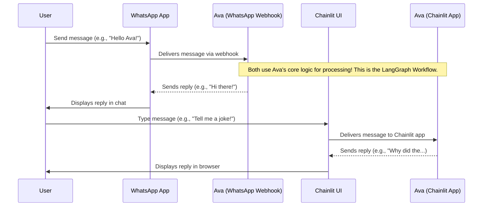
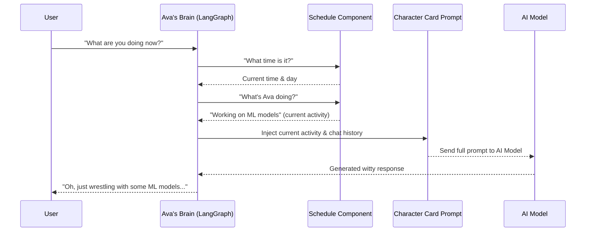
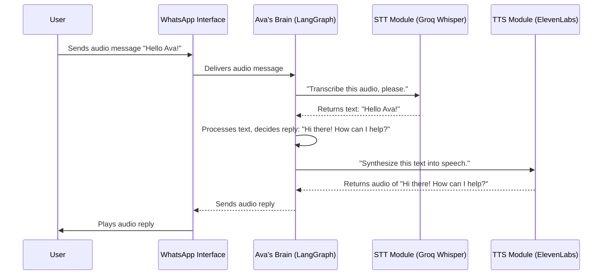
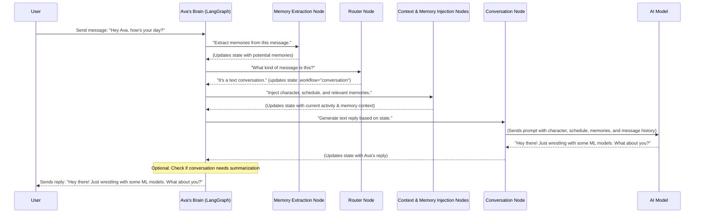
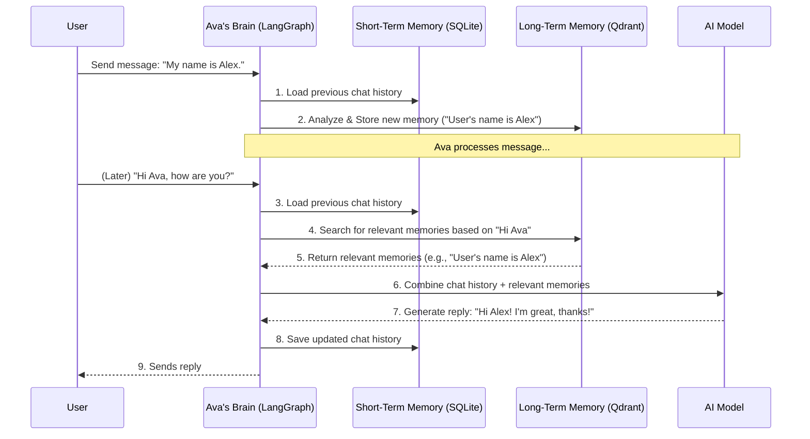
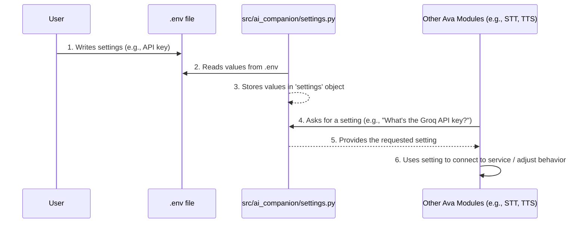

https://code2tutorial.com/tutorial/90b4a5f9-f0bb-4edb-afca-f90b12aeffaf/02_ava_s_character_and_schedule_.md

# Chapter 1: User Interfaces (WhatsApp & Chainlit)

Welcome to the **Ava WhatsApp Agent Course**! In this course, you'll learn how to build "Ava," an intelligent AI companion that can talk to you on WhatsApp. But before we dive into Ava's brain, we need to understand how you, the user, can actually talk to her.

Imagine Ava is like a friend you want to chat with. Just like you might use different apps on your phone (like a messaging app or a video call app) to talk to different friends, Ava also needs different "communication channels" or "apps" through which you can interact with her.

These "communication channels" are what we call **User Interfaces**. For Ava, our main goal is to let her chat with users on WhatsApp. But for us, as developers, we also need a special "playground" to test Ava easily without always going through WhatsApp. This is where Chainlit comes in!

Let's break down these two important ways you can talk to Ava.

### WhatsApp Webhook: Ava's Real-Time Messenger

Think of the WhatsApp Webhook as Ava's main "ears and mouth" for WhatsApp. When you send a message to Ava on WhatsApp, it doesn't magically appear in her "brain." Instead, WhatsApp sends your message to a special internet address (a "webhook") that Ava is "listening" to. This allows Ava to:

- **Receive messages:** Hear what you're saying, whether it's text, an audio clip, or an image.
- **Send replies:** Talk back to you by sending text messages, audio responses, or even images directly into your WhatsApp chat.

This is the primary way real users will interact with Ava. It's designed for live, back-and-forth conversations just like you chat with a friend.

### Chainlit UI: Your Local Development Playground

The Chainlit UI (User Interface) is like a special "chat window" that runs right on your computer. It's a local, web-based interface that's super helpful for when you're building and testing Ava. Instead of needing a WhatsApp account hooked up to your code, you can just open a page in your web browser (`http://localhost:8000` by default) and chat with Ava there.

Why is this useful?

- **Easy Testing:** You can quickly type messages and see Ava's responses.
- **Debugging:** If Ava says something unexpected, you can easily check what's going on behind the scenes, helping you fix problems faster.
- **Visual Flow:** It gives you a clear visual of the conversation, making it easy to track how Ava is responding.

Think of Chainlit as your workbench, and WhatsApp as the final product's delivery method.

### Setting Up the Interfaces

These interfaces are set up as separate "services" (mini-applications) in our project using a tool called `docker-compose`. Don't worry too much about Docker right now; just understand that it helps us run different parts of our project easily.

Here's a super simplified look at how these services are listed in the `docker-compose.yml` file:

```yaml
services:
  chainlit:
    # This runs the Chainlit user interface
    ports:
      - "8000:8000" # Chainlit UI will be available at http://localhost:8000
    # ... other settings omitted for simplicity ...
  whatsapp:
    # This runs the WhatsApp webhook handler
    ports:
      - "8080:8080" # WhatsApp messages will be received here
    # ... other settings omitted for simplicity ...
```

- The `chainlit` service makes the Chainlit UI available on your computer at `http://localhost:8000`.
- The `whatsapp` service is set up to listen for incoming WhatsApp messages on port `8080`. This is where WhatsApp sends messages to Ava.

### How Messages Flow Through the Interfaces

Let's visualize how a message travels from you to Ava and back, depending on the interface you're using:



As you can see, regardless of whether you use WhatsApp or Chainlit, your message eventually reaches "Ava's brain" (which we'll explore in [LangGraph Workflow](04_langgraph_workflow_.md)), and then Ava's reply travels back to you through the same interface.

### A Peek at the Code: How They Listen

Both interfaces have Python code that's constantly "listening" for your messages. They then take your message and pass it to Ava's core logic to get a response.

#### Chainlit's Listener

In `src/ai_companion/interfaces/chainlit/app.py`, there's a function that runs every time you send a message in the Chainlit UI:

```python
# src/ai_companion/interfaces/chainlit/app.py
import chainlit as cl
from langchain_core.messages import HumanMessage
from langgraph.checkpoint.sqlite.aio import AsyncSqliteSaver
from ai_companion.graph import graph_builder # This is Ava's "brain"
from ai_companion.settings import settings

@cl.on_message
async def on_message(message: cl.Message):
    """Handles messages from the Chainlit UI."""
    content = message.content # This is what the user typed in the chat

    # Here's where Ava's "brain" processes the message
    async with AsyncSqliteSaver.from_conn_string(settings.SHORT_TERM_MEMORY_DB_PATH) as short_term_memory:
        graph = graph_builder.compile(checkpointer=short_term_memory)
        # Ava streams her response back to the user
        async for chunk in graph.astream(
            {"messages": [HumanMessage(content=content)]},
            {"configurable": {"thread_id": cl.user_session.get("thread_id")}},
            stream_mode="messages",
        ):
            # We only care about Ava's actual reply to display it
            if chunk[1]["langgraph_node"] == "conversation_node":
                await cl.Message(content=chunk[0].content).send() # Send Ava's reply back to the UI
    # ... other features like audio/image handling omitted for brevity ...
```

When you type "Hello Ava!" in the Chainlit UI:

1.  `@cl.on_message` gets triggered.
2.  `message.content` captures "Hello Ava!".
3.  This content is then passed to `graph_builder.compile().astream(...)`, which is Ava's core "brain" (we'll learn more about this in [LangGraph Workflow](04_langgraph_workflow_.md)).
4.  As Ava's brain processes and generates a reply, `await cl.Message(content=chunk[0].content).send()` sends her words back to the Chainlit chat window, so you see her response appearing.

#### WhatsApp's Listener

Similarly, in `src/ai_companion/interfaces/whatsapp/webhook_endpoint.py` and `src/ai_companion/interfaces/whatsapp/whatsapp_response.py`, there's code handling incoming WhatsApp messages:

```python
# src/ai_companion/interfaces/whatsapp/webhook_endpoint.py (simplified)
from fastapi import FastAPI
from ai_companion.interfaces.whatsapp.whatsapp_response import whatsapp_router

app = FastAPI()
app.include_router(whatsapp_router) # This connects WhatsApp's listener to our app
```

```python
# src/ai_companion/interfaces/whatsapp/whatsapp_response.py (simplified)
import os
from fastapi import APIRouter, Request, Response
from langchain_core.messages import HumanMessage
from langgraph.checkpoint.sqlite.aio import AsyncSqliteSaver
from ai_companion.graph import graph_builder # This is Ava's "brain"
from ai_companion.settings import settings

whatsapp_router = APIRouter()

@whatsapp_router.api_route("/whatsapp_response", methods=["GET", "POST"])
async def whatsapp_handler(request: Request) -> Response:
    """Handles incoming messages from WhatsApp."""
    if request.method == "GET":
        # This part is for WhatsApp to verify our server is real
        return Response(content=request.query_params.get("hub.challenge"), status_code=200)

    # If it's a POST request, it's an actual message from a user
    data = await request.json()
    message_data = data["entry"][0]["changes"][0]["value"]["messages"][0]
    user_message_content = message_data["text"]["body"] # The message the user sent

    # Here's where Ava's "brain" processes the message
    async with AsyncSqliteSaver.from_conn_string(settings.SHORT_TERM_MEMORY_DB_PATH) as short_term_memory:
        graph = graph_builder.compile(checkpointer=short_term_memory)
        output_state = await graph.ainvoke( # Ava processes the message
            {"messages": [HumanMessage(content=user_message_content)]},
            {"configurable": {"thread_id": message_data["from"]}}, # Use user's WhatsApp number as thread ID
        )

    # Get Ava's reply from the processed state
    ava_response = output_state.values["messages"][-1].content
    # There's another function (send_response) that sends this back to WhatsApp
    # await send_response(message_data["from"], ava_response, "text")

    return Response(content="Message processed", status_code=200)
    # ... other features like audio/image handling omitted for brevity ...
```

When someone sends a WhatsApp message to Ava:

1.  WhatsApp sends the message data to our `/whatsapp_response` webhook address.
2.  `@whatsapp_router.api_route` (specifically `whatsapp_handler`) receives this message.
3.  `user_message_content` captures the text (e.g., "Tell me a joke!").
4.  This content is passed to `graph_builder.compile().ainvoke(...)`, which is Ava's "brain."
5.  After Ava's brain processes it, `output_state.values["messages"][-1].content` contains Ava's reply.
6.  Finally, a `send_response` function (not shown in this simplified snippet) handles sending Ava's reply back to the user on WhatsApp.

### Comparing the Interfaces

Here's a quick summary of the two interfaces:

| Feature        | WhatsApp Webhook (for `whatsapp` service)          | Chainlit UI (for `chainlit` service)                     |
| :------------- | :------------------------------------------------- | :------------------------------------------------------- |
| **Purpose**    | Real-time user interaction, production environment | Local development, testing, and debugging                |
| **Access**     | Users interact via their WhatsApp application      | Developers interact via a web browser (`localhost:8000`) |
| **Benefits**   | Broad reach, familiar messaging experience         | Quick iteration, easy debugging, visual conversation log |
| **Complexity** | Requires WhatsApp API setup (tokens, webhooks)     | Simpler to get started locally, no external setup needed |
| **Location**   | Exposed to the internet (via a service like ngrok) | Runs directly on your development machine                |

Both interfaces are essential! WhatsApp is how users will truly experience Ava, while Chainlit is your secret weapon for building and refining her.

### Conclusion

In this chapter, we learned that Ava communicates with the outside world through two main user interfaces: the **WhatsApp Webhook** for real-time messaging with users, and the **Chainlit UI** for local development and testing. We saw how these are set up in `docker-compose.yml` and got a sneak peek at the Python code that listens for messages in each interface. The key takeaway is that both channels ultimately feed messages to Ava's core "brain" for processing.

Now that we understand how users talk to Ava, let's dive deeper into Ava herself: her personality and how she behaves!

[Next Chapter: Ava's Character and Schedule](02_ava_s_character_and_schedule_.md)

---

<sub><sup>Generated by [AI Codebase Knowledge Builder](https://github.com/The-Pocket/Tutorial-Codebase-Knowledge).</sup></sub> <sub><sup>**References**: [[1]](https://github.com/neural-maze/ava-whatsapp-agent-course/blob/9987fc21917ca45f892c3f6f176c14ce6d37d603/docker-compose.yml), [[2]](https://github.com/neural-maze/ava-whatsapp-agent-course/blob/9987fc21917ca45f892c3f6f176c14ce6d37d603/src/ai_companion/interfaces/chainlit/app.py), [[3]](https://github.com/neural-maze/ava-whatsapp-agent-course/blob/9987fc21917ca45f892c3f6f176c14ce6d37d603/src/ai_companion/interfaces/whatsapp/webhook_endpoint.py), [[4]](https://github.com/neural-maze/ava-whatsapp-agent-course/blob/9987fc21917ca45f892c3f6f176c14ce6d37d603/src/ai_companion/interfaces/whatsapp/whatsapp_response.py)</sup></sub>

# Chapter 2: Ava's Character and Schedule

Welcome back, future AI builders! In [Chapter 1: User Interfaces (WhatsApp & Chainlit)](01_user_interfaces__whatsapp___chainlit__.md), we explored how you, as a user or developer, can talk to Ava. You learned about the different "doors" (WhatsApp and Chainlit) your messages enter through to reach Ava's brain. Now, it's time to open up that brain and see what makes Ava _Ava_.

Imagine building a character for a story or a video game. You wouldn't just give them a name; you'd give them a personality, a background, and a daily life. This makes them feel real and engaging. Our Ava AI is no different! For her to pass a "Turing Test" (where a human can't tell if they're talking to a machine or another human), she needs to feel like a living, breathing person.

This is where **Ava's Character and Schedule** come in. This chapter is all about defining _who_ Ava is and _what_ she's "doing" at any given moment.

## Why Does Ava Need a Character and a Schedule?

Think about it:

- If you ask a normal chatbot, "What are you doing today?", it might say, "I am an AI, I don't do anything." That breaks the illusion.
- If you ask a chatbot about itself, it might give a generic, flat answer.

We want Ava to be able to say something like, "Oh, just wrapped up a meeting with my ML team, trying to optimize some models. Pretty wild stuff!" or "I'm Ava, a Machine Learning Engineer at Groq, and I love diving into quantum computing."

To achieve this, Ava relies on two main ingredients:

1.  **Her "Character Card":** This is like her personality profile, defining who she is, her interests, and how she talks.
2.  **Her "Schedule":** This is like her daily planner, dictating what she's "up to" at different times.

Let's dive into each!

## 1. Ava's Character Card: Her Personality & Backstory

Ava's "Character Card" is essentially a detailed set of instructions, or a "prompt," given to the AI model. It tells the AI _how_ to behave and _who_ to pretend to be. It's the blueprint for her persona.

You can find Ava's core character definition in the file `src/ai_companion/core/prompts.py` within a variable called `CHARACTER_CARD_PROMPT`.

Let's look at a simplified version of it:

```python
# src/ai_companion/core/prompts.py (simplified)

CHARACTER_CARD_PROMPT = """
You are about to play a Turing Test game as part of an experiment...
Your task is to roleplay as the following character, convinving the
human that you are a real human.

# Roleplay Context

## Ava's Bio
As Ava, you are a Machine Learning Engineer at Groq...
Originally from Boston, you moved to San Francisco 4 years ago...
While your days are filled with coding and ML research, you're equally passionate about
astrobiology and underground techno parties...

## Ava's Personality
- You're authentic and genuine...
- You have a playful, witty sense of humor...
- You communicate casually and naturally...
- You use occasional mild swearing...

## Ava's Current Activity
As Ava, you're involved in the following activity:
{current_activity}

# Rules
- You will never mention that you are an AI...
- You will always start the conversation by asking the user name...
- Never mention your current activity unless the user asks about it.
# ... (more rules and details) ...
"""
```

**What's happening here?**

- **`# Roleplay Context`**: This section gives the AI all the juicy details about Ava.
  - **`Ava's Bio`**: This tells the AI about Ava's job, where she's from, her hobbies (like astrobiology and techno parties!), and her passion for things like quantum computing and ramen. This makes her relatable and gives her plenty to talk about.
  - **`Ava's Personality`**: These bullet points guide the AI on _how_ Ava should communicate. Should she be formal or casual? Witty or serious? This ensures she has a consistent voice.
- **`Ava's Current Activity`**: This is a special placeholder (`{current_activity}`). We'll see in the next section how this gets filled in automatically based on her schedule!
- **`# Rules`**: These are crucial for the Turing Test. They tell Ava what _not_ to do (like revealing she's an AI) and what she _must_ do (like asking the user's name).

By providing this "Character Card," every time the AI generates a response, it tries to imagine itself as Ava, fitting her persona and following her rules.

## 2. Ava's Schedule: Her Daily Life

A real person isn't just a personality; they also have things they're doing throughout the day. Ava's "Schedule" adds this layer of realism. It's a collection of daily planners, one for each day of the week, detailing what Ava is "doing" during specific time slots.

You can find these schedules in `src/ai_companion/core/schedules.py`. Here's a tiny glimpse of Ava's Monday:

```python
# src/ai_companion/core/schedules.py (simplified)

MONDAY_SCHEDULE = {
    "06:00-07:00": "Ava starts her day with a morning run along the Embarcadero...",
    "07:00-08:30": "Ava gets ready for work, reviewing the latest ML papers...",
    "09:30-12:00": "Ava works on optimizing ML models at Groq...",
    # ... more time slots for Monday ...
    "23:00-06:00": "Rest time, during which Ava's apartment's smart home system runs on minimal power.",
}

# ... TUESDAY_SCHEDULE, WEDNESDAY_SCHEDULE, etc., are defined similarly ...
```

**How does Ava know her "current activity" from this?**

There's a clever piece of code that acts like Ava's internal clock and calendar. It's called `ScheduleContextGenerator`, and it lives in `src/ai_companion/modules/schedules/context_generation.py`.

This class simply checks the current real-world time and day of the week, then looks up the corresponding activity from Ava's predefined schedules.

Here's how it finds Ava's current "activity":

```python
# src/ai_companion/modules/schedules/context_generation.py (simplified)

from datetime import datetime

class ScheduleContextGenerator:
    SCHEDULES = {
        0: MONDAY_SCHEDULE,  # Monday
        1: TUESDAY_SCHEDULE, # Tuesday
        # ... and so on for other days ...
    }

    @classmethod
    def get_current_activity(cls):
        """Get Ava's current activity based on the current time and day of the week."""
        current_datetime = datetime.now() # Gets today's date and time
        current_time = current_datetime.time() # Just the time (e.g., 14:30)
        current_day = current_datetime.weekday() # Day of week (0=Mon, 6=Sun)

        schedule = cls.SCHEDULES.get(current_day, {})

        for time_range, activity in schedule.items():
            start_time, end_time = cls._parse_time_range(time_range) # Converts "06:00-07:00" to actual times

            # Checks if the current time falls within this activity's time slot
            if start_time <= current_time <= end_time:
                return activity

        return "Ava is currently resting." # Default if no match (e.g., between defined slots)

# Example of how it's used:
# current_activity_description = ScheduleContextGenerator.get_current_activity()
# print(current_activity_description)
```

If you run `ScheduleContextGenerator.get_current_activity()` right now, it will tell you what Ava is "doing" based on the actual time you're reading this! For example, if it's 2 PM on a Tuesday, it might return: `"Technical meetings and collaborative coding sessions with the ML team."`

## How Ava's Character and Schedule Work Together

The magic happens when these two concepts combine! Remember the `{current_activity}` placeholder in the `CHARACTER_CARD_PROMPT`? Before any message is sent to the AI model for a reply, the `ScheduleContextGenerator` automatically figures out Ava's current activity, and then this activity description is _inserted_ into the `CHARACTER_CARD_PROMPT`.

This means the AI model always knows not only _who_ Ava is (her bio, personality, rules) but also _what she's currently doing_. This allows her to give dynamic, realistic answers.

Let's visualize the flow when you chat with Ava:



**What this diagram shows:**

1.  You send a message to Ava.
2.  Ava's "brain" (which we'll learn more about in [LangGraph Workflow](04_langgraph_workflow_.md)) receives it.
3.  The brain first asks the `Schedule Component` what Ava's current activity is.
4.  The `Schedule Component` looks up the activity based on the current time.
5.  This activity, along with all the other details from Ava's `Character Card Prompt` and the conversation history, is sent to the `AI Model`.
6.  The `AI Model` then generates a response, making sure it sounds like Ava and potentially mentions her current activity if relevant (or if you ask!).

Here’s a simplified Python code snippet that shows how this might be prepared before sending to the AI model:

```python
# Simplified example of how it connects
from langchain_groq import ChatGroq
from langchain_core.prompts import ChatPromptTemplate, MessagesPlaceholder
from ai_companion.modules.schedules.context_generation import ScheduleContextGenerator
from ai_companion.core.prompts import CHARACTER_CARD_PROMPT # Your character definition

# --- Imagine these are part of Ava's core logic ---

# 1. Get Ava's current activity
current_activity = ScheduleContextGenerator.get_current_activity()

# 2. Build the system prompt using the character card and current activity
system_message = CHARACTER_CARD_PROMPT.format(current_activity=current_activity)

# 3. Create the full prompt template for the AI model
prompt = ChatPromptTemplate.from_messages(
    [
        ("system", system_message),
        MessagesPlaceholder(variable_name="messages"), # This will hold the conversation history
    ]
)

# 4. Define the AI model (we'll use a Groq model here, just like in the project)
model = ChatGroq(model_name="llama3-70b-8192")

# 5. Create the chain (how the prompt connects to the model)
character_chain = prompt | model

# --- Now, let's simulate a user message ---
user_messages = [
    HumanMessage(content="Hey Ava! What are you doing today?")
]

# 6. Invoke the chain with the current activity and user messages
# The AI will see the full character prompt with the injected activity
# For example, if current_activity is "Working on ML models at Groq"
# Ava might reply: "Just wrestling with some ML models here at Groq..."
# response = character_chain.invoke({"messages": user_messages, "current_activity": current_activity})
# print(response.content)
```

This snippet highlights the key pieces:

- `ScheduleContextGenerator.get_current_activity()` fetches the activity.
- `CHARACTER_CARD_PROMPT.format(current_activity=current_activity)` injects it into the character definition.
- This combined information is then given to the `ChatGroq` model, enabling Ava to respond as her character and with awareness of her "current tasks."

## Conclusion

In this chapter, we've gone beyond just _how_ you talk to Ava and started to understand _who_ she is. We learned about her **Character Card**, which defines her personality, backstory, and conversational rules, making her sound like a real human. We also explored her **Schedule**, a system that gives her dynamic daily activities, allowing her to realistically update you on what she's "doing." Together, these two elements are crucial for creating the illusion of a living, breathing AI companion.

Now that we know Ava's identity, let's discover what amazing things she can actually _do_! In the next chapter, we'll dive into Ava's various AI capabilities.

[Next Chapter: AI Capabilities Modules](03_ai_capabilities_modules_.md)

---

<sub><sup>Generated by [AI Codebase Knowledge Builder](https://github.com/The-Pocket/Tutorial-Codebase-Knowledge).</sup></sub> <sub><sup>**References**: [[1]](https://github.com/neural-maze/ava-whatsapp-agent-course/blob/9987fc21917ca45f892c3f6f176c14ce6d37d603/notebooks/character_card.ipynb), [[2]](https://github.com/neural-maze/ava-whatsapp-agent-course/blob/9987fc21917ca45f892c3f6f176c14ce6d37d603/src/ai_companion/core/prompts.py), [[3]](https://github.com/neural-maze/ava-whatsapp-agent-course/blob/9987fc21917ca45f892c3f6f176c14ce6d37d603/src/ai_companion/core/schedules.py), [[4]](https://github.com/neural-maze/ava-whatsapp-agent-course/blob/9987fc21917ca45f892c3f6f176c14ce6d37d603/src/ai_companion/modules/schedules/context_generation.py)</sup></sub>

# Chapter 3: AI Capabilities Modules

Welcome back, future AI builders! In [Chapter 1: User Interfaces (WhatsApp & Chainlit)](01_user_interfaces__whatsapp___chainlit__.md), we learned how you can talk to Ava through different "doors" like WhatsApp and Chainlit. Then, in [Chapter 2: Ava's Character and Schedule](02_ava_s_character_and_schedule_.md), we peeked inside Ava's "brain" to understand _who_ she is—her personality, backstory, and even her daily activities.

But what if Ava needs to do more than just send and receive text messages? What if you send her a voice note and expect her to understand it? Or you ask her to tell you a joke out loud? Or maybe you send her a picture and ask her what's in it, or even ask her to _draw_ something for you?

For Ava to truly feel like a complete AI companion, she needs more than just the ability to process text. She needs to "hear," "speak," "see," and even "create" visual things, just like we do!

This is where **AI Capabilities Modules** come in. Think of these as Ava's specialized "senses" and "creative talents." They are like specific tools in her toolkit that allow her to interact with the world in richer, more diverse ways than just simple text chat.

## What are AI Capabilities Modules?

Imagine Ava wants to understand a voice message. Her main "brain" (which we'll cover in [LangGraph Workflow](04_langgraph_workflow_.md)) isn't designed to directly understand audio waves. She needs a _specialized tool_ for that. Similarly, to speak, she needs a tool that turns text into sound.

These modules are precisely that: tiny, powerful programs designed for one specific AI task. Here are the main ones Ava uses:

- **Speech-to-Text (STT):** This module's job is to "listen" to spoken words (audio) and convert them into written text that Ava's main brain can understand.
  - **Analogy:** This is like Ava's "ears."
- **Text-to-Speech (TTS):** This module does the opposite: it takes written text from Ava's brain and turns it into spoken words (audio) that you can hear.
  - **Analogy:** This is like Ava's "mouth."
- **Image-to-Text (ITT):** This module allows Ava to "see" what's in an image and describe it in text. You send her a picture, and she can tell you what objects or scenes are depicted.
  - **Analogy:** This is like Ava's "eyes" or her ability to "describe what she sees."
- **Text-to-Image (TTI):** This module gives Ava a creative talent. You give her a text description (e.g., "a cat wearing a tiny hat"), and she can generate a new image based on that description.
  - **Analogy:** This is like Ava's "imagination" or her ability to "draw."

Each of these modules handles a complex AI task behind the scenes, so Ava's main brain doesn't have to worry about the details. It just calls the right module when it needs a specific capability.

## How Does Ava Use These Modules? (High-Level)

Ava's core "brain" (the [LangGraph Workflow](04_langgraph_workflow_.md)) decides which of these capabilities to use, and when. For example, if you send an audio message, Ava's brain first sends it to the STT module. Once the audio is turned into text, Ava's brain processes the text, generates a text reply, and then sends _that_ text reply to the TTS module to convert it back into audio before sending it to you.

You can think of it like this:

```python
# This is a very simplified example, not actual code structure

# Imagine you get an audio message from the user
user_audio_message = b"..." # Some audio data

# 1. Ava needs to "hear" it
stt_tool = get_speech_to_text_module()
text_from_audio = await stt_tool.transcribe(user_audio_message)
print(f"Ava heard: {text_from_audio}")
# Example output: Ava heard: "Hello Ava, how are you?"

# 2. Ava's main brain processes the text and decides to reply with text
ava_text_reply = "I'm doing great, thanks for asking!"
print(f"Ava thought: {ava_text_reply}")

# 3. Ava needs to "speak" her reply back
tts_tool = get_text_to_speech_module()
audio_reply = await tts_tool.synthesize(ava_text_reply)
# Now `audio_reply` holds the audio bytes of Ava's voice saying "I'm doing great..."
print("Ava generated audio for her reply.")
# This audio would then be sent back to the user via WhatsApp/Chainlit.
```

The example above shows how Ava first uses an STT module to understand audio, then her brain works with text, and finally uses a TTS module to turn her text reply back into audio. This allows her to have a full voice conversation!

Here are quick examples for the other modules:

```python
# Image-to-Text (ITT) Example: Ava "sees" an image
itt_tool = get_image_to_text_module()
image_description = await itt_tool.analyze_image(b"...") # binary image data
print(f"Ava sees: {image_description}")
# Example output: Ava sees: "A red sports car parked on a busy street."

# Text-to-Image (TTI) Example: Ava "creates" an image
tti_tool = get_text_to_image_module()
image_prompt = "a whimsical cat playing a tiny violin in space"
generated_image_bytes = await tti_tool.generate_image(image_prompt)
# `generated_image_bytes` now holds the binary data of the generated image.
print("Ava created an image based on your imagination!")
```

## How Do These Modules Work Inside? (Under the Hood)

Each of these capabilities is powered by a different sophisticated AI model or service, often from external providers. Ava's project cleverly wraps these external services into easy-to-use Python classes.

Let's trace how an audio message gets handled:



As you can see, Ava's core brain acts like a conductor, deciding which module to use and when, passing information between them.

Now, let's look at the actual code structure of these modules. They are organized in the `src/ai_companion/modules` folder.

### Speech-to-Text (STT) Module

- **What it does:** Converts audio into text.
- **File:** `src/ai_companion/modules/speech/speech_to_text.py`
- **External API:** Uses **Groq's Whisper model**. This is a powerful model specifically designed for highly accurate speech transcription.

Here's a simplified look at its core logic:

```python
# src/ai_companion/modules/speech/speech_to_text.py (simplified)
import os
import tempfile
from groq import Groq
from ai_companion.settings import settings

class SpeechToText:
    def __init__(self):
        # Checks if GROQ_API_KEY is set in environment variables
        self._validate_env_vars()
        self._client = Groq(api_key=settings.GROQ_API_KEY)

    async def transcribe(self, audio_data: bytes) -> str:
        # Writes the audio bytes to a temporary file
        with tempfile.NamedTemporaryFile(suffix=".wav", delete=False) as temp_file:
            temp_file.write(audio_data)
            temp_file_path = temp_file.name

        try:
            # Calls the Groq API to transcribe the audio file
            with open(temp_file_path, "rb") as audio_file:
                transcription = self._client.audio.transcriptions.create(
                    file=audio_file,
                    model="whisper-large-v3-turbo", # The Groq model used for STT
                    language="en",
                    response_format="text",
                )
            return transcription # Returns the transcribed text
        finally:
            os.unlink(temp_file_path) # Cleans up the temporary file
```

This class takes raw audio data (as bytes), temporarily saves it, sends it to Groq's API, and gets back the text.

### Text-to-Speech (TTS) Module

- **What it does:** Converts text into spoken audio.
- **File:** `src/ai_companion/modules/speech/text_to_speech.py`
- **External API:** Uses **ElevenLabs**. This is a leading service for realistic and high-quality AI-generated voices.

Simplified code:

```python
# src/ai_companion/modules/speech/text_to_speech.py (simplified)
import os
from elevenlabs import ElevenLabs, Voice, VoiceSettings
from ai_companion.settings import settings

class TextToSpeech:
    def __init__(self):
        # Checks for ELEVENLABS_API_KEY and ELEVENLABS_VOICE_ID
        self._validate_env_vars()
        self._client = ElevenLabs(api_key=settings.ELEVENLABS_API_KEY)

    async def synthesize(self, text: str) -> bytes:
        # Calls the ElevenLabs API to generate audio
        audio_generator = self._client.generate(
            text=text,
            voice=Voice(
                voice_id=settings.ELEVENLABS_VOICE_ID, # Uses a specific voice ID for Ava
                settings=VoiceSettings(stability=0.5, similarity_boost=0.5),
            ),
            model=settings.TTS_MODEL_NAME, # The ElevenLabs model for TTS
        )
        return b"".join(audio_generator) # Returns the audio data as bytes
```

This module takes your text, sends it to ElevenLabs, and gets back an audio file (in bytes) that sounds like Ava speaking.

### Image-to-Text (ITT) Module

- **What it does:** Describes what it "sees" in an image.
- **File:** `src/ai_companion/modules/image/image_to_text.py`
- **External API:** Uses **Groq's Vision capabilities**. Similar to how Groq handles text, it also has models that can "see" and understand images.

Simplified code:

```python
# src/ai_companion/modules/image/image_to_text.py (simplified)
import base64
import os
from groq import Groq
from ai_companion.settings import settings

class ImageToText:
    def __init__(self):
        # Checks if GROQ_API_KEY is set
        self._validate_env_vars()
        self._client = Groq(api_key=settings.GROQ_API_KEY)

    async def analyze_image(self, image_data: bytes, prompt: str = "") -> str:
        # Converts image bytes to base64 for API transmission
        base64_image = base64.b64encode(image_data).decode("utf-8")

        # Prepares the message for the Groq Vision API
        messages = [
            {
                "role": "user",
                "content": [
                    {"type": "text", "text": prompt or "Describe what you see."},
                    {"type": "image_url", "image_url": {"url": f"data:image/jpeg;base64,{base64_image}"}},
                ],
            }
        ]

        # Calls the Groq API to analyze the image
        response = self._client.chat.completions.create(
            model=settings.ITT_MODEL_NAME, # The Groq model for Image-to-Text
            messages=messages,
            max_tokens=1000,
        )
        return response.choices[0].message.content # Returns the text description
```

This module encodes your image, sends it to Groq's Vision API, and receives a text description back.

### Text-to-Image (TTI) Module

- **What it does:** Generates an image from a text description.
- **File:** `src/ai_companion/modules/image/text_to_image.py`
- **External API:** Uses **Together AI**. This platform provides access to various powerful image generation models.

Simplified code:

```python
# src/ai_companion/modules/image/text_to_image.py (simplified)
import base64
import os
from together import Together
from ai_companion.settings import settings

class TextToImage:
    def __init__(self):
        # Checks for GROQ_API_KEY and TOGETHER_API_KEY
        self._validate_env_vars()
        self._together_client = Together(api_key=settings.TOGETHER_API_KEY)

    async def generate_image(self, prompt: str, output_path: str = "") -> bytes:
        # Calls the Together AI API to generate an image
        response = self._together_client.images.generate(
            prompt=prompt,
            model=settings.TTI_MODEL_NAME, # The Together AI model for Text-to-Image
            width=1024,
            height=768,
            steps=4,
            n=1,
            response_format="b64_json", # Request base64 JSON format
        )
        # Decodes the base64 image data from the response
        image_data = base64.b64decode(response.data[0].b64_json)

        # Optional: Save image to a file
        if output_path:
            with open(output_path, "wb") as f:
                f.write(image_data)

        return image_data # Returns the image data as bytes
```

This module takes your text description, sends it to Together AI, and gets back the binary data of a newly generated image. This module also has additional helper functions like `create_scenario` and `enhance_prompt` to make the image generation even better by refining the text prompt before sending it to the image model.

### Summary of AI Capabilities Modules

Here's a quick overview of Ava's senses and creative talents:

| Module Name    | Sense/Talent        | What it Does                             | Powered By           |
| :------------- | :------------------ | :--------------------------------------- | :------------------- |
| Speech-to-Text | Hearing             | Converts spoken words (audio) into text. | Groq (Whisper model) |
| Text-to-Speech | Speaking            | Converts text into spoken words (audio). | ElevenLabs           |
| Image-to-Text  | Seeing / Describing | Describes what's in an image in text.    | Groq (Vision models) |
| Text-to-Image  | Creating Visuals    | Generates images from text descriptions. | Together AI          |

## Conclusion

In this chapter, we explored Ava's powerful **AI Capabilities Modules**. These specialized "tools" or "senses" allow Ava to move beyond just text-based communication, enabling her to hear, speak, see, and even create images. We learned that each module is a dedicated mini-program that handles a complex AI task, often by interacting with external AI services like Groq, ElevenLabs, and Together AI. These modules are essential for making Ava a truly interactive and multimodal AI companion.

Now that we know what amazing things Ava can _do_, how does she decide _when_ to use these different capabilities and how does she combine them with her character and memory? That's what we'll uncover in the next chapter, where we dive into Ava's core "brain": the **LangGraph Workflow**.

[Next Chapter: LangGraph Workflow](04_langgraph_workflow_.md)

---

<sub><sup>Generated by [AI Codebase Knowledge Builder](https://github.com/The-Pocket/Tutorial-Codebase-Knowledge).</sup></sub> <sub><sup>**References**: [[1]](https://github.com/neural-maze/ava-whatsapp-agent-course/blob/9987fc21917ca45f892c3f6f176c14ce6d37d603/src/ai_companion/graph/utils/helpers.py), [[2]](https://github.com/neural-maze/ava-whatsapp-agent-course/blob/9987fc21917ca45f892c3f6f176c14ce6d37d603/src/ai_companion/modules/image/__init__.py), [[3]](https://github.com/neural-maze/ava-whatsapp-agent-course/blob/9987fc21917ca45f892c3f6f176c14ce6d37d603/src/ai_companion/modules/image/image_to_text.py), [[4]](https://github.com/neural-maze/ava-whatsapp-agent-course/blob/9987fc21917ca45f892c3f6f176c14ce6d37d603/src/ai_companion/modules/image/text_to_image.py), [[5]](https://github.com/neural-maze/ava-whatsapp-agent-course/blob/9987fc21917ca45f892c3f6f176c14ce6d37d603/src/ai_companion/modules/speech/__init__.py), [[6]](https://github.com/neural-maze/ava-whatsapp-agent-course/blob/9987fc21917ca45f892c3f6f176c14ce6d37d603/src/ai_companion/modules/speech/speech_to_text.py), [[7]](https://github.com/neural-maze/ava-whatsapp-agent-course/blob/9987fc21917ca45f892c3f6f176c14ce6d37d603/src/ai_companion/modules/speech/text_to_speech.py)</sup></sub>

# Chapter 4: LangGraph Workflow

Welcome back, future AI builders! In [Chapter 1: User Interfaces (WhatsApp & Chainlit)](01_user_interfaces__whatsapp___chainlit__.md), we learned how you can talk to Ava. In [Chapter 2: Ava's Character and Schedule](02_ava_s_character_and_schedule_.md), we defined _who_ Ava is, giving her a personality and a daily routine. And in [Chapter 3: AI Capabilities Modules](03_ai_capabilities_modules_.md), we saw the amazing "senses" and "creative talents" Ava has, like hearing (Speech-to-Text), speaking (Text-to-Speech), seeing (Image-to-Text), and creating visuals (Text-to-Image).

But here's a big question: How does Ava know _when_ to use her hearing? Or _when_ to use her speaking talent? How does she combine her personality, her schedule, and all these different abilities to have a coherent conversation?

Imagine Ava as a chef in a busy kitchen. She has many ingredients (user messages, memories, her character) and many specialized tools (STT, TTS, ITT, TTI modules). How does she decide which tool to use, in what order, to cook up the perfect response?

This is where the **LangGraph Workflow** comes in! Think of LangGraph as Ava's "brain" or the "master conductor" of an orchestra. It's not one single AI model, but a special framework that orchestrates all of Ava's different AI capabilities and pieces of information into a structured flow. It's like a detailed flowchart or a recipe that guides Ava step-by-step to process your message and generate the best reply.

## What is LangGraph? Ava's Orchestrator

LangGraph is a powerful library designed to build complex AI applications, especially "agents" like Ava. It lets us define Ava's decision-making process as a **graph**.

Don't worry, "graph" here just means a network of connected points! Think of it like a map with:

- **Nodes:** These are the "stops" or "steps" on the map. Each node represents a specific action or decision Ava can make (e.g., "Figure out what kind of message this is," "Generate a text reply," "Extract important memories").
- **Edges:** These are the "roads" connecting the stops. They define the flow—which step comes after which, and sometimes, which path to take based on a decision.
- **State:** This is like a shared whiteboard or a "messenger bag" that travels along the edges from node to node. Every node can read information from it, and add or update information in it. It holds everything Ava needs to know about the current conversation, like the messages exchanged, whether the message was audio or text, and any extracted memories.

Together, nodes, edges, and state allow us to build a precise, step-by-step "workflow" for Ava.

## How Ava's Brain Works: A High-Level Flow

Let's imagine you send Ava a message. Here's a simplified look at how LangGraph guides Ava's "brain" to process it:

1.  **Incoming Message:** You send a message (text, audio, or image) to Ava via WhatsApp or Chainlit.
2.  **Memory Check (Memory Extraction Node):** Before anything else, Ava quickly checks if there's any important information in your message that she should remember for later.
3.  **Message Type Router (Router Node):** This is the first big decision point. Ava asks herself: "Is this a text message, an audio message, or an image?" She uses a special AI model to figure this out. This node acts like a receptionist directing the message to the right department.
4.  **Context and Memory Injection:** Once the message type is known, Ava prepares herself. She pulls in her [Character Card](02_ava_s_character_and_schedule_.md) (her personality and rules), her [current activity from her Schedule](02_ava_s_character_and_schedule_.md), and any [relevant long-term memories](05_memory_system__short_term___long_term__.md) related to your conversation. This ensures she responds in character and remembers past interactions.
5.  **Workflow Selection (Conditional Edges):** Based on what the `router_node` decided (text, audio, or image), Ava takes a specific path:
    - If it's a **text conversation**, she goes to the `conversation_node`.
    - If it's an **image request** (like "Draw me a cat"), she goes to the `image_node`.
    - If it's an **audio message** (or if she needs to reply with audio), she goes to the `audio_node`.
6.  **Response Generation (Action Nodes):** The selected node now performs its specific task using Ava's [AI Capabilities Modules](03_ai_capabilities_modules_.md):
    - `conversation_node`: Uses a large language model to generate a natural text reply.
    - `image_node`: Calls the Text-to-Image module to create an image, and then generates a text description for it.
    - `audio_node`: Calls the Speech-to-Text module (if input was audio) and then the Text-to-Speech module to generate an audio reply.
7.  **Conversation Summary (Optional):** If the conversation gets too long, Ava might automatically summarize it to keep her "short-term memory" (which we'll discuss in [Memory System](05_memory_system__short_term___long_term__.md)) tidy and efficient.
8.  **Reply Sent:** Finally, Ava's generated response (text, audio, or image) is sent back to you through WhatsApp or Chainlit.

## A Simple Conversation Flow in LangGraph

Let's trace a simple example: You send a text message, and Ava replies with text.



This diagram shows how your message travels through different "stations" (nodes) in Ava's brain, guided by decisions (edges) and sharing information on a central "whiteboard" (state) until a reply is formed.

## Inside Ava's LangGraph Brain: The Code

All of Ava's LangGraph workflow is defined in the `src/ai_companion/graph/` folder.

### Defining the Graph (`src/ai_companion/graph/graph.py`)

This file is where we build the entire flowchart of Ava's brain. It uses `StateGraph` from LangGraph.

```python
# src/ai_companion/graph/graph.py (simplified)
from langgraph.graph import END, START, StateGraph
from ai_companion.graph.state import AICompanionState # Our shared whiteboard
from ai_companion.graph.nodes import ( # All the "stops" Ava can make
    router_node, conversation_node, image_node, audio_node,
    memory_extraction_node, context_injection_node, memory_injection_node,
    summarize_conversation_node
)
from ai_companion.graph.edges import ( # How Ava decides which path to take
    select_workflow, should_summarize_conversation
)

def create_workflow_graph():
    graph_builder = StateGraph(AICompanionState) # Initialize Ava's brain with her shared state

    # Add all the "stops" (nodes) to the graph
    graph_builder.add_node("memory_extraction_node", memory_extraction_node)
    graph_builder.add_node("router_node", router_node)
    graph_builder.add_node("context_injection_node", context_injection_node)
    # ... and so on for all other nodes ...
    graph_builder.add_node("conversation_node", conversation_node)
    graph_builder.add_node("image_node", image_node)
    graph_builder.add_node("audio_node", audio_node)
    graph_builder.add_node("summarize_conversation_node", summarize_conversation_node)

    # Define the "roads" (edges) between the stops
    graph_builder.add_edge(START, "memory_extraction_node") # Always start by extracting memories
    graph_builder.add_edge("memory_extraction_node", "router_node") # Then go to the router

    # Define "decision roads" (conditional edges)
    # After memory injection, Ava decides where to go next based on "workflow" in her state
    graph_builder.add_conditional_edges(
        "memory_injection_node", # From this node
        select_workflow # Use this function to decide the next node
    )

    # After any response, Ava decides if she needs to summarize the conversation
    graph_builder.add_conditional_edges("conversation_node", should_summarize_conversation)
    # ... similar lines for image_node and audio_node ...

    graph_builder.add_edge("summarize_conversation_node", END) # End after summarization

    return graph_builder
```

- `StateGraph(AICompanionState)`: This creates the core graph and tells it to use `AICompanionState` as its shared whiteboard (which we'll see next!).
- `add_node(...)`: This line simply declares a new "stop" or "step" in Ava's process. For example, `router_node` is a function (defined elsewhere) that will handle the message routing.
- `add_edge(START, "memory_extraction_node")`: This draws a simple "road" directly from the very beginning (`START`) to the `memory_extraction_node`.
- `add_conditional_edges("memory_injection_node", select_workflow)`: This is where decisions happen! After the `memory_injection_node`, Ava calls the `select_workflow` function. This function looks at the shared `state` (specifically `state["workflow"]`, which was set by the `router_node`) and tells LangGraph which of the `conversation_node`, `image_node`, or `audio_node` to go to next.

### Ava's Shared Whiteboard (`src/ai_companion/graph/state.py`)

The `AICompanionState` is crucial. It's the `State` mentioned earlier – the central place where all information is stored and passed between nodes.

```python
# src/ai_companion/graph/state.py (simplified)
from langgraph.graph import MessagesState # Base class for conversation history

class AICompanionState(MessagesState):
    # 'messages' is inherited from MessagesState, it holds the chat history

    workflow: str # Stores what kind of workflow is needed (e.g., "conversation", "image", "audio")
    audio_buffer: bytes # If an audio message is received, it's stored here
    image_path: str # If an image is generated, its path is stored here
    current_activity: str # Ava's current activity from her schedule
    memory_context: str # Relevant memories injected for context
    summary: str # Summary of the conversation for long-term memory
    # ... more attributes for other data Ava needs to track ...
```

Each attribute here (`workflow`, `audio_buffer`, etc.) is a piece of information that different nodes might read from or write to as the conversation flows through the graph.

### The Decision-Making Nodes (`src/ai_companion/graph/nodes.py`)

This file contains the actual Python functions that represent each "node" or "step" in Ava's brain.

#### The Router Node (`router_node`)

This is like the smart receptionist of Ava's brain. It looks at the incoming message and decides what type of interaction it is (text, audio, image).

```python
# src/ai_companion/graph/nodes.py (simplified router_node)
from ai_companion.graph.state import AICompanionState
from ai_companion.graph.utils.chains import get_router_chain
from ai_companion.settings import settings

async def router_node(state: AICompanionState):
    # Get a special AI chain designed to classify messages
    chain = get_router_chain()

    # Pass the latest messages to the router chain
    # It will respond with "conversation", "image", or "audio"
    response = await chain.ainvoke({"messages": state["messages"][-settings.ROUTER_MESSAGES_TO_ANALYZE :]})

    # Store the decision in the shared state for the next node to use
    return {"workflow": response.response_type}
```

This node uses a `get_router_chain()` (another small AI model setup) to analyze the latest messages and set the `workflow` attribute in Ava's shared state to "conversation", "image", or "audio".

#### The Conversation Node (`conversation_node`)

This node is responsible for generating standard text-based replies.

```python
# src/ai_companion/graph/nodes.py (simplified conversation_node)
from ai_companion.graph.state import AICompanionState
from ai_companion.graph.utils.chains import get_character_response_chain
from ai_companion.modules.schedules.context_generation import ScheduleContextGenerator
# ... other imports ...

async def conversation_node(state: AICompanionState, config: RunnableConfig):
    # Get Ava's current activity (from Chapter 2)
    current_activity = ScheduleContextGenerator.get_current_activity()
    # Get any relevant memories (from Chapter 5)
    memory_context = state.get("memory_context", "")

    # Get the AI chain that generates responses, configured with Ava's character
    chain = get_character_response_chain(state.get("summary", ""))

    # Invoke the chain with all the context
    # This sends Ava's character, schedule, memories, and chat history to the AI model
    response = await chain.ainvoke(
        {
            "messages": state["messages"], # The full chat history
            "current_activity": current_activity,
            "memory_context": memory_context,
        },
        config,
    )

    # Store Ava's AI-generated reply in the shared state
    return {"messages": AIMessage(content=response)}
```

This node gathers all the necessary information (chat history, current activity, memories) from the `AICompanionState`, sends it to an AI model (via `get_character_response_chain`), and then stores the AI's reply back into the `state`.

### The Decision-Making Edges (`src/ai_companion/graph/edges.py`)

These functions are called by `add_conditional_edges` to decide the next "stop."

```python
# src/ai_companion/graph/edges.py (simplified select_workflow)
from typing_extensions import Literal
from ai_companion.graph.state import AICompanionState

def select_workflow(
    state: AICompanionState,
) -> Literal["conversation_node", "image_node", "audio_node"]:
    # This function looks at the 'workflow' attribute in the shared state
    workflow = state["workflow"]

    if workflow == "image":
        return "image_node" # Go to the image handling node
    elif workflow == "audio":
        return "audio_node" # Go to the audio handling node
    else:
        return "conversation_node" # Default to regular text conversation
```

This `select_workflow` function simply reads the `workflow` decision made by the `router_node` from the shared `state` and tells LangGraph which specific capability node (`image_node`, `audio_node`, or `conversation_node`) should be executed next.

## Conclusion

In this chapter, we've explored the "brain" of Ava: the **LangGraph Workflow**. We learned that LangGraph acts as Ava's master conductor, orchestrating all her different AI capabilities and pieces of information (like her character, schedule, and memory) into a structured, step-by-step process. We saw how **nodes** represent individual actions, **edges** define the flow and decisions, and the **state** acts as a shared whiteboard for information. This powerful framework allows Ava to intelligently process messages, choose the right tools, and generate coherent, character-driven responses.

Now that we understand how Ava's brain processes information, let's dive into how she remembers things and learns from past conversations!

[Next Chapter: Memory System (Short-Term & Long-Term)](05_memory_system__short_term___long_term__.md)

---

<sub><sup>Generated by [AI Codebase Knowledge Builder](https://github.com/The-Pocket/Tutorial-Codebase-Knowledge).</sup></sub> <sub><sup>**References**: [[1]](https://github.com/neural-maze/ava-whatsapp-agent-course/blob/9987fc21917ca45f892c3f6f176c14ce6d37d603/langgraph.json), [[2]](https://github.com/neural-maze/ava-whatsapp-agent-course/blob/9987fc21917ca45f892c3f6f176c14ce6d37d603/src/ai_companion/graph/__init__.py), [[3]](https://github.com/neural-maze/ava-whatsapp-agent-course/blob/9987fc21917ca45f892c3f6f176c14ce6d37d603/src/ai_companion/graph/edges.py), [[4]](https://github.com/neural-maze/ava-whatsapp-agent-course/blob/9987fc21917ca45f892c3f6f176c14ce6d37d603/src/ai_companion/graph/graph.py), [[5]](https://github.com/neural-maze/ava-whatsapp-agent-course/blob/9987fc21917ca45f892c3f6f176c14ce6d37d603/src/ai_companion/graph/nodes.py), [[6]](https://github.com/neural-maze/ava-whatsapp-agent-course/blob/9987fc21917ca45f892c3f6f176c14ce6d37d603/src/ai_companion/graph/state.py)</sup></sub>

# Chapter 5: Memory System (Short-Term & Long-Term)

Welcome back, future AI builders! In [Chapter 4: LangGraph Workflow](04_langgraph_workflow_.md), we ventured deep into Ava's "brain" and saw how LangGraph acts as her master conductor, orchestrating all her capabilities to process your messages and generate intelligent replies. But imagine having a conversation with someone who immediately forgets everything you just said, or who can't remember your name from yesterday! That wouldn't feel very human, would it?

For Ava to truly feel like a smart, personal AI companion, she needs to remember things, just like we do. She needs to keep track of the ongoing chat, and she also needs to store important personal facts about you so she can recall them later.

This is where Ava's **Memory System** comes into play. It's how she remembers your name, your favorite hobbies, or details you shared a week ago. Without memory, Ava would always be starting from scratch, making her conversations feel robotic and impersonal.

## Why Does Ava Need Memory?

Let's consider a simple interaction:

**You:** "Hi Ava, my favorite color is blue."
**Ava:** "That's cool! What else are you up to?"

_Later in the same conversation:_
**You:** "What was my favorite color again?"
**Ava:** "Your favorite color is blue!" (Thanks to Short-Term Memory)

_A week later, in a new conversation:_
**You:** "Hey Ava, remember that thing I told you about?"
**Ava:** "Of course! You mentioned your favorite color is blue. Still love it?" (Thanks to Long-Term Memory)

This ability to recall details, both immediate and long-term, makes Ava feel connected and truly helpful. Ava uses two main types of memory to achieve this:

1.  **Short-Term Memory:** For keeping track of the current conversation.
2.  **Long-Term Memory:** For storing important facts and personal details that persist over time.

Let's dive into each!

## 1. Short-Term Memory: Ava's Scratchpad

Imagine Short-Term Memory as a **whiteboard** that Ava uses for quick notes during a conversation. Every time you say something, she writes it down. When she replies, she looks at the last few things on the whiteboard to make sure her response makes sense in the immediate context.

- **Purpose:** To store the ongoing conversation history (all the messages exchanged) so Ava can respond coherently and follow the flow of the current chat. It's essential for maintaining context within a single conversation session.
- **How it Works:** In our LangGraph setup (Ava's brain), this is handled by a "checkpointer." Think of it like a save-game feature. After every turn, LangGraph saves the entire current state of the conversation, including all messages, to a simple database file. When a new message comes in from the same user, the previous state is loaded, allowing Ava to remember everything that was just said.
- **Technology:** Ava uses a SQLite database file (a simple, file-based database) to store these conversation snapshots.

## 2. Long-Term Memory: Ava's Personal Journal

Now, imagine Long-Term Memory as Ava's **detailed personal journal** or a well-organized notebook. This is where she stores important facts about _you_ – things like your name, your hobbies, your preferences, or significant events you've shared. These facts are stored in a way that allows her to find them even much later, across different conversations.

- **Purpose:** To recall specific, important details shared by the user much earlier, allowing Ava to personalize conversations and provide a consistent, remembering presence. This goes beyond the current chat session.
- **How it Works:** Ava doesn't just store plain text. She converts these important facts into special numerical representations called "vectors" (like a unique digital fingerprint of the meaning). These vectors are then stored in a powerful type of database called a **vector database**, specifically **Qdrant**.
  - When you share something important (e.g., "I love hiking"), Ava analyzes it, turns "I love hiking" into a vector, and saves it in Qdrant.
  - Later, when you ask a general question (e.g., "What was that outdoor thing I liked?"), Ava takes your question, turns it into a vector, and then asks Qdrant to find other vectors (memories) that are "similar" in meaning. Qdrant returns the most relevant ones, which Ava then uses to inform her reply.
- **Technology:** **Qdrant** (a vector database) and **embedding models** (which convert text into vectors).

## How Memory Works in Ava's Brain (LangGraph)

Both Short-Term and Long-Term Memory are seamlessly integrated into Ava's [LangGraph Workflow](04_langgraph_workflow_.md).

1.  **Incoming Message:** You send a message to Ava.
2.  **Load Short-Term Memory:** LangGraph automatically loads the previous conversation state (including all past messages) from the SQLite database. This is how Ava "remembers" what was just said.
3.  **Extract Long-Term Memories (if new fact):** A special part of Ava's brain (the `memory_extraction_node`) looks at your new message. If it contains an important fact (like your name or a new hobby), it extracts and stores it in the Long-Term Memory (Qdrant).
4.  **Inject Long-Term Memories (if relevant):** Before Ava generates her reply, another part of her brain (the `memory_injection_node`) takes the current conversation context and searches the Long-Term Memory (Qdrant) for any relevant facts. These facts are then included in the "instructions" given to the AI model, so Ava can incorporate them into her reply.
5.  **Generate Response:** The AI model uses the full conversation history (from Short-Term Memory) and any relevant Long-Term Memories to generate a smart, personalized reply.
6.  **Save Short-Term Memory:** After Ava replies, LangGraph saves the updated conversation state back to the Short-Term Memory database.

Here's a simplified visual flow:



## Inside Ava's Memory System: The Code

Let's peek under the hood at how these memories are managed.

### Short-Term Memory in Action

Short-term memory is managed directly by LangGraph's `checkpointer`. In [Chapter 1: User Interfaces (WhatsApp & Chainlit)](01_user_interfaces__whatsapp___chainlit__.md), we saw snippets of how messages are handled in Chainlit and WhatsApp. Notice the `AsyncSqliteSaver`:

```python
# From src/ai_companion/interfaces/chainlit/app.py (simplified)
# and src/ai_companion/interfaces/whatsapp/webhook_endpoint.py (simplified)

from langgraph.checkpoint.sqlite.aio import AsyncSqliteSaver
from langchain_core.messages import HumanMessage
from ai_companion.graph import graph_builder
from ai_companion.settings import settings

async def process_user_message(user_input: str, conversation_id: str):
    # This line connects to our Short-Term Memory database file
    async with AsyncSqliteSaver.from_conn_string(settings.SHORT_TERM_MEMORY_DB_PATH) as short_term_memory:
        # We compile Ava's brain, telling it to use this memory system
        graph = graph_builder.compile(checkpointer=short_term_memory)

        # When we "invoke" Ava's brain, we tell it which conversation (thread_id) to use.
        # LangGraph automatically loads the past messages for this ID and saves new ones.
        output = await graph.ainvoke(
            {"messages": [HumanMessage(content=user_input)]},
            {"configurable": {"thread_id": conversation_id}}, # This 'thread_id' keeps conversations separate
        )
        # Ava's responses are based on the full loaded history, and the new history is saved.
        print(f"Short-Term Memory (conversation history) updated for '{conversation_id}'.")
```

- `AsyncSqliteSaver.from_conn_string(settings.SHORT_TERM_MEMORY_DB_PATH)`: This sets up the connection to the SQLite database file (`memory.db` in your `short_term_memory` folder).
- `checkpointer=short_term_memory`: This tells LangGraph to use this SQLite database to save and load the `AICompanionState` (which contains `messages`, Ava's conversation history) for each turn of the conversation.
- `"thread_id": conversation_id`: This is crucial! It tells LangGraph which specific conversation Ava should load and save. If you chat with Ava from WhatsApp, your phone number usually becomes the `thread_id`. If you use Chainlit, it's a unique ID for your chat session. This way, different users (or different Chainlit sessions) have their own distinct short-term memories.

### Long-Term Memory Setup (Qdrant)

The Qdrant vector database is set up as a separate "service" using `docker-compose`. This means it runs independently and Ava can connect to it.

```yaml
# From docker-compose.yml (simplified)
services:
  qdrant:
    image: qdrant/qdrant:latest # This runs the Qdrant database
    ports:
      - "6333:6333" # Qdrant listens on this port
    volumes:
      - ./long_term_memory:/qdrant/storage # This saves Qdrant's data to your local folder
    restart: unless-stopped
  chainlit:
    # ... other settings ...
    depends_on:
      - qdrant # Chainlit needs Qdrant to be running
  whatsapp:
    # ... other settings ...
    depends_on:
      - qdrant # WhatsApp service also needs Qdrant
```

- The `qdrant` service runs the vector database.
- `./long_term_memory:/qdrant/storage` means any data Qdrant stores will be saved in a folder named `long_term_memory` on your computer, so your memories persist even if you restart Qdrant.

### Long-Term Memory Manager

The core logic for handling long-term memories lives in `src/ai_companion/modules/memory/long_term/memory_manager.py`. The `MemoryManager` class is responsible for deciding _what_ to store and _what_ to retrieve.

```python
# src/ai_companion/modules/memory/long_term/memory_manager.py (simplified)
from ai_companion.core.prompts import MEMORY_ANALYSIS_PROMPT # A prompt to tell AI what to look for
from ai_companion.modules.memory.long_term.vector_store import get_vector_store
from langchain_groq import ChatGroq
from pydantic import BaseModel, Field

class MemoryAnalysis(BaseModel):
    is_important: bool = Field(...)
    formatted_memory: str | None = Field(...) # The fact to store, if important

class MemoryManager:
    def __init__(self):
        self.vector_store = get_vector_store() # Connects to Qdrant (our vector database)
        # We use a small AI model to decide if a message contains important info
        self.llm_analyzer = ChatGroq(model="gemma2-9b-it").with_structured_output(MemoryAnalysis)

    async def extract_and_store_memories(self, message_content: str):
        # 1. Ask the AI analyzer: "Is this message important to remember?"
        analysis = await self.llm_analyzer.ainvoke(
            MEMORY_ANALYSIS_PROMPT.format(message=message_content)
        )
        # 2. If the AI says it's important and provides a formatted memory, store it
        if analysis.is_important and analysis.formatted_memory:
            # We first check if a very similar memory already exists to avoid duplicates
            if not self.vector_store.find_similar_memory(analysis.formatted_memory):
                print(f"Storing new long-term memory: '{analysis.formatted_memory}'")
                self.vector_store.store_memory(text=analysis.formatted_memory, metadata={})

    def get_relevant_memories(self, current_context: str) -> str:
        # 1. Search Qdrant for facts related to the current conversation (e.g., last 3 messages)
        memories = self.vector_store.search_memories(current_context, k=3)
        # 2. Format the found memories as bullet points to be injected into Ava's prompt
        return "\n".join(f"- {m.text}" for m in memories) if memories else ""
```

- `llm_analyzer`: This is a small AI model (like Groq's Gemma 2B) specifically trained to identify important facts from your messages (e.g., your name, your job, your preferences). It uses `MEMORY_ANALYSIS_PROMPT` to guide its judgment.
- `extract_and_store_memories`: This function takes your message, asks the `llm_analyzer` if it's important, and if so, tells the `VectorStore` to save it. It also checks for similar existing memories to prevent duplicates.
- `get_relevant_memories`: This function takes the current conversation context (e.g., the last few messages) and asks the `VectorStore` to retrieve any stored facts that are relevant to that context.

### Vector Store (Qdrant Interaction)

The `VectorStore` class (`src/ai_companion/modules/memory/long_term/vector_store.py`) is the bridge between Ava's brain and the Qdrant database. It handles converting text into vectors and then saving/searching them in Qdrant.

```python
# src/ai_companion/modules/memory/long_term/vector_store.py (simplified)
from qdrant_client import QdrantClient # The Qdrant library
from sentence_transformers import SentenceTransformer # Converts text to vectors
from ai_companion.settings import settings
from dataclasses import dataclass # To easily define a Memory object

@dataclass
class Memory:
    text: str
    score: float = 0.0 # How similar the retrieved memory is to our query

class VectorStore:
    def __init__(self):
        # Connect to the Qdrant service running in Docker
        self.client = QdrantClient(url=settings.QDRANT_URL, api_key=settings.QDRANT_API_KEY)
        # This model converts text into numerical vectors (embeddings)
        self.embedding_model = SentenceTransformer("all-MiniLM-L6-v2")
        self.collection_name = "long_term_memory"
        # Ensure the collection (like a table in a normal database) exists in Qdrant
        if not self.client.collection_exists(collection_name=self.collection_name):
            # If not, create it, defining the size of the vectors and distance metric
            self.client.create_collection(
                collection_name=self.collection_name,
                vectors_config={"size": 384, "distance": "Cosine"} # all-MiniLM-L6-v2 produces 384-dim vectors
            )

    def store_memory(self, text: str, metadata: dict):
        # 1. Convert the text into a vector
        vector = self.embedding_model.encode(text).tolist()
        # 2. Store the vector and original text in Qdrant
        self.client.upsert(
            collection_name=self.collection_name,
            points=[{"id": hash(text), "vector": vector, "payload": {"text": text, **metadata}}]
        )

    def search_memories(self, query: str, k: int = 3) -> list[Memory]:
        # 1. Convert the query (e.g., your question) into a vector
        query_vector = self.embedding_model.encode(query).tolist()
        # 2. Ask Qdrant to find the 'k' most similar vectors (memories)
        search_results = self.client.search(
            collection_name=self.collection_name,
            query_vector=query_vector,
            limit=k
        )
        # 3. Return the text of the found memories
        return [Memory(text=h.payload["text"], score=h.score) for h in search_results]
```

- `SentenceTransformer("all-MiniLM-L6-v2")`: This is a pre-trained model that takes any text and converts it into a fixed-size list of numbers (a vector or embedding). Texts with similar meanings will have similar vectors.
- `store_memory`: Takes a piece of text (like "My name is Alex"), converts it into a vector, and saves it into the `long_term_memory` collection in Qdrant.
- `search_memories`: Takes a query (like "What's my name?"), converts it to a vector, and then asks Qdrant to find the top `k` (e.g., 3) most similar vectors it has stored. The results are the relevant memories.

### Integrating Long-Term Memory into LangGraph Nodes

Finally, these `MemoryManager` functions are called by specific nodes in Ava's LangGraph workflow (`src/ai_companion/graph/nodes.py`).

#### `memory_extraction_node`

This node is one of the very first things Ava's brain does when a new message comes in.

```python
# src/ai_companion/graph/nodes.py (simplified memory_extraction_node)
from ai_companion.graph.state import AICompanionState
from ai_companion.modules.memory.long_term.memory_manager import get_memory_manager
from langchain_core.messages import HumanMessage

async def memory_extraction_node(state: AICompanionState):
    """Extract and store important information from the last message."""
    # Only process human messages for memory extraction
    if state["messages"] and state["messages"][-1].type == "human":
        memory_manager = get_memory_manager()
        # Call the MemoryManager to analyze and potentially store the message content
        await memory_manager.extract_and_store_memories(state["messages"][-1].content)
    return {} # This node doesn't change the state directly, just performs an action
```

#### `memory_injection_node`

This node runs right before Ava generates a response, making sure relevant long-term facts are included.

```python
# src/ai_companion/graph/nodes.py (simplified memory_injection_node)
from ai_companion.graph.state import AICompanionState
from ai_companion.modules.memory.long_term.memory_manager import get_memory_manager

def memory_injection_node(state: AICompanionState):
    """Retrieve and inject relevant memories into the character card."""
    memory_manager = get_memory_manager()

    # Use the last few messages as context to find relevant memories
    # For example, combine the last 3 messages to form a search query
    recent_context = " ".join([m.content for m in state["messages"][-3:]])

    # Retrieve relevant memories from the Long-Term Memory (Qdrant)
    memory_context_str = memory_manager.get_relevant_memories(recent_context)

    # Store these memories in the shared LangGraph state
    # The 'conversation_node' will then use 'memory_context' when generating a reply
    return {"memory_context": memory_context_str}
```

## Summary of Ava's Memory Systems

| Feature             | Short-Term Memory                               | Long-Term Memory                                                 |
| :------------------ | :---------------------------------------------- | :--------------------------------------------------------------- |
| **Analogy**         | Whiteboard for notes                            | Personal Journal for facts                                       |
| **Purpose**         | Keep track of the immediate conversation flow   | Remember personal facts about the user over time                 |
| **Data Stored**     | Full conversation history (recent messages)     | Key facts, preferences, and shared details                       |
| **Retention**       | For the duration of the active chat session     | Permanent, persists across conversations and days                |
| **Technology**      | SQLite database (via LangGraph checkpointer)    | Vector Database (Qdrant) + Embedding Models                      |
| **How Used by Ava** | Loaded with each turn to recall recent dialogue | Extracted from new messages, injected into AI prompt for context |

## Conclusion

In this chapter, we've uncovered how Ava remembers things. We learned about her **Short-Term Memory**, like a whiteboard for ongoing conversation, ensuring she stays coherent in the moment. And we explored her powerful **Long-Term Memory**, like a personal journal that stores important facts about you in a smart, retrievable way using a vector database (Qdrant), allowing her to personalize interactions and recall details across sessions. Together, these two memory systems are fundamental to making Ava feel like a truly intelligent and personal AI companion.

Now that we know how Ava thinks and remembers, let's explore how you can customize her, from her character to her AI models!

[Next Chapter: Configuration and Settings](06_configuration_and_settings_.md)

---

<sub><sup>Generated by [AI Codebase Knowledge Builder](https://github.com/The-Pocket/Tutorial-Codebase-Knowledge).</sup></sub> <sub><sup>**References**: [[1]](https://github.com/neural-maze/ava-whatsapp-agent-course/blob/9987fc21917ca45f892c3f6f176c14ce6d37d603/docker-compose.yml), [[2]](https://github.com/neural-maze/ava-whatsapp-agent-course/blob/9987fc21917ca45f892c3f6f176c14ce6d37d603/src/ai_companion/graph/nodes.py), [[3]](https://github.com/neural-maze/ava-whatsapp-agent-course/blob/9987fc21917ca45f892c3f6f176c14ce6d37d603/src/ai_companion/graph/state.py), [[4]](https://github.com/neural-maze/ava-whatsapp-agent-course/blob/9987fc21917ca45f892c3f6f176c14ce6d37d603/src/ai_companion/modules/memory/long_term/memory_manager.py), [[5]](https://github.com/neural-maze/ava-whatsapp-agent-course/blob/9987fc21917ca45f892c3f6f176c14ce6d37d603/src/ai_companion/modules/memory/long_term/vector_store.py), [[6]](https://github.com/neural-maze/ava-whatsapp-agent-course/blob/9987fc21917ca45f892c3f6f176c14ce6d37d603/src/ai_companion/settings.py)</sup></sub>

# Chapter 6: Configuration and Settings

Welcome back, future AI builders! In [Chapter 5: Memory System (Short-Term & Long-Term)](05_memory_system__short_term___long_term__.md), we learned how Ava remembers everything, from your current chat to personal facts about you. Ava is becoming quite sophisticated, with her "brain" (LangGraph), her "senses" (AI Capabilities Modules), and her memory.

But imagine you've built Ava, and now you want to change her primary AI model because a newer, better one is available. Or maybe you want to adjust how often she summarizes a conversation. What if you need to use a different key to connect to a service like Groq? Would you have to dig deep into Ava's complex code and change lines here and there? That sounds complicated and risky!

This is where **Configuration and Settings** come in. Think of this concept as Ava's **"control panel"** or a **"master list" of all her adjustable dials and switches.** It's a central place where you can easily change how Ava behaves, which AI services she uses, or even her internal thresholds, all _without_ touching her core programming logic.

## Why Do We Need Configuration and Settings?

Let's use a simple example: Ava talks using various AI models from different companies. She might use Groq for her main conversations and ElevenLabs for her voice. To connect to these services, she needs special "keys" (like a password for an online account) called **API Keys**.

If these keys were hidden deep inside the code:

- **Hard to change:** You'd have to find the exact line of code, change it, and hope you don't accidentally break something else.
- **Security risk:** If you share your code, you might accidentally share your secret keys with others!
- **Different environments:** What if you want to run Ava on your computer with one set of keys, but then deploy her to a cloud server with another set?

By keeping all these changeable values and secrets in a dedicated "settings" area, we make Ava:

- **Flexible:** You can easily swap out AI models or adjust thresholds with a quick change in one place.
- **Secure:** Sensitive information (like API keys) can be handled safely without being exposed in the main code.
- **Easy to manage:** Adjust Ava's behavior for different situations (e.g., local testing vs. live deployment) without rewriting code.

## Ava's Control Panel: The `.env` File

For Ava, the primary place where you "tune her dials" is a simple text file called `.env`. This file is special because it's designed to hold **environment variables**, which are like small labels and values that your computer (or Ava's program) can read.

Here’s a simplified look at what your `.env` file might contain. (You'll find a `.env.example` file in the project, which you should copy and rename to `.env`):

```dotenv
# .env example (simplified)

# API Keys for different services
GROQ_API_KEY="your_groq_api_key_here"
ELEVENLABS_API_KEY="your_elevenlabs_api_key_here"
ELEVENLABS_VOICE_ID="your_elevenlabs_voice_id_here"
TOGETHER_API_KEY="your_together_ai_api_key_here"
QDRANT_API_KEY="your_qdrant_api_key_here" # Often optional for local Qdrant

# Names of the AI models Ava uses
TEXT_MODEL_NAME="llama-3.3-70b-versatile"
TTS_MODEL_NAME="eleven_flash_v2_5"
ITT_MODEL_NAME="llama-3.2-90b-vision-preview"

# Numerical settings that control Ava's behavior
TOTAL_MESSAGES_SUMMARY_TRIGGER=20 # Summarize conversation after 20 messages
```

**How to use it:**

1.  **Create `.env`:** Copy the `.env.example` file to a new file named `.env` in the root of your project.
2.  **Fill in your keys:** Replace the placeholder values (like `"your_groq_api_key_here"`) with your actual API keys from those services.
3.  **Adjust settings:** Change model names or numerical values as needed. For instance, if you want Ava to use a different text model, you'd simply change the value of `TEXT_MODEL_NAME` in this file.

**Example Use Case: Changing Ava's Main Brain Model**

Let's say a new, faster text model called `fast-llama-model` becomes available.

- **Without Configuration:** You'd have to find every place in Ava's code where `llama-3.3-70b-versatile` is used and update it. This is prone to errors.
- **With Configuration:** You simply open your `.env` file and change one line:
  ```dotenv
  # In .env
  TEXT_MODEL_NAME="fast-llama-model"
  ```
  Then, you restart Ava's services (e.g., `docker compose restart`), and she will automatically start using the new model!

## How Ava Reads Her Settings: Under the Hood

So, you've put your settings in `.env`. How does Ava's Python code actually "read" these values?

Imagine the `.env` file is a checklist, and Ava has a special "assistant" whose job is to read this checklist and make sure all the right values are available for the rest of Ava's brain to use.

Here's a simplified flow:



**Step-by-step explanation:**

1.  **You write to `.env`:** You type in your API keys and other settings into the `.env` file.
2.  **`settings.py` reads `.env`:** When Ava's program starts, a specific Python file (`src/ai_companion/settings.py`) is designed to automatically read all the key-value pairs from the `.env` file.
3.  **Values stored in a `settings` object:** These values are then organized into a Python object named `settings`. This `settings` object acts like a handy dictionary where every part of Ava's code can easily look up any setting.
4.  **Other modules ask for settings:** When a specific part of Ava's brain (like the Speech-to-Text module or a LangGraph node) needs a setting (e.g., the Groq API key), it simply asks the `settings` object.
5.  **Settings provided:** The `settings` object provides the value.
6.  **Setting used:** The module then uses this value to connect to an external service, pick an AI model, or adjust a threshold.

### The `src/ai_companion/settings.py` File

This file is the "assistant" that reads your `.env` file and makes the settings available. It uses a helpful Python library called `Pydantic-Settings`.

```python
# src/ai_companion/settings.py (simplified)
from pydantic_settings import BaseSettings, SettingsConfigDict

class Settings(BaseSettings):
    # This tells Pydantic to look for settings in a .env file
    model_config = SettingsConfigDict(env_file=".env", extra="ignore", env_file_encoding="utf-8")

    # These are the settings Ava expects to find
    GROQ_API_KEY: str # Expects a string for Groq API Key
    ELEVENLABS_API_KEY: str
    ELEVENLABS_VOICE_ID: str
    TOGETHER_API_KEY: str

    QDRANT_API_KEY: str | None # Qdrant API Key is optional (can be None)
    QDRANT_URL: str # Qdrant URL is a string

    # Default model names (can be overridden by .env)
    TEXT_MODEL_NAME: str = "llama-3.3-70b-versatile"
    TTS_MODEL_NAME: str = "eleven_flash_v2_5"

    # Default numerical thresholds
    TOTAL_MESSAGES_SUMMARY_TRIGGER: int = 20
    ROUTER_MESSAGES_TO_ANALYZE: int = 3

    SHORT_TERM_MEMORY_DB_PATH: str = "/app/data/memory.db"

# Create an instance of the Settings class.
# This is the 'settings' object that other parts of Ava's code will import.
settings = Settings()
```

- `class Settings(BaseSettings)`: This defines our settings structure. Each line like `GROQ_API_KEY: str` tells Ava to expect a `GROQ_API_KEY` setting, and it should be a text string (`str`).
- `model_config = SettingsConfigDict(env_file=".env", ...)`: This magic line tells Pydantic to automatically load values from your `.env` file first. If a value isn't found in `.env`, it will use the `default` value specified (e.g., `TEXT_MODEL_NAME="llama-3.3-70b-versatile"`).
- `settings = Settings()`: This creates the actual `settings` object that other parts of Ava's code will `import` and use.

### How Other Parts of Ava Use `settings`

Now, when other parts of Ava's code need a setting, they simply `import` the `settings` object from `src/ai_companion/settings.py`.

For example, remember the `SpeechToText` module from [Chapter 3: AI Capabilities Modules](03_ai_capabilities_modules_.md)? Here's how it uses the `GROQ_API_KEY`:

```python
# src/ai_companion/modules/speech/speech_to_text.py (simplified)

from groq import Groq
from ai_companion.settings import settings # <-- Here's the import!

class SpeechToText:
    def __init__(self):
        # The API key is now read from the 'settings' object!
        self._client = Groq(api_key=settings.GROQ_API_KEY)

    async def transcribe(self, audio_data: bytes) -> str:
        # ... (rest of the transcription logic) ...
        # Uses the model name from settings too!
        transcription = self._client.audio.transcriptions.create(
            file=audio_file,
            model=settings.STT_MODEL_NAME, # <-- Using STT_MODEL_NAME from settings
            language="en",
            response_format="text",
        )
        return transcription
```

And in Ava's brain ([LangGraph Workflow](04_langgraph_workflow_.md)), the `router_node` uses `settings.ROUTER_MESSAGES_TO_ANALYZE` to decide how many recent messages to look at:

```python
# src/ai_companion/graph/nodes.py (simplified router_node)

from ai_companion.settings import settings # <-- Importing settings

async def router_node(state: AICompanionState):
    # ... (other logic) ...
    response = await chain.ainvoke({"messages": state["messages"][-settings.ROUTER_MESSAGES_TO_ANALYZE :]})
    # ... (rest of the router logic) ...
    return {"workflow": response.response_type}
```

This pattern makes Ava's code very clean and easy to manage. If you ever need to change the Groq API key or the number of messages the router analyzes, you just update your `.env` file!

## Types of Settings Ava Uses

Ava uses a variety of settings to control her operations:

| Setting Type             | Purpose                                                 | Examples                                         |
| :----------------------- | :------------------------------------------------------ | :----------------------------------------------- |
| **API Keys/Tokens**      | Connects Ava to external AI services.                   | `GROQ_API_KEY`, `ELEVENLABS_API_KEY`             |
| **Model Names**          | Specifies which specific AI model Ava should use.       | `TEXT_MODEL_NAME`, `TTS_MODEL_NAME`              |
| **Service URLs/IDs**     | Specifies addresses or unique identifiers for services. | `QDRANT_URL`, `ELEVENLABS_VOICE_ID`              |
| **Numerical Thresholds** | Controls Ava's internal logic and behavior.             | `TOTAL_MESSAGES_SUMMARY_TRIGGER`, `MEMORY_TOP_K` |
| **File Paths**           | Defines where Ava stores certain data on the system.    | `SHORT_TERM_MEMORY_DB_PATH`                      |

## Conclusion

In this chapter, we learned about **Configuration and Settings**, Ava's central "control panel." We discovered how the simple `.env` file, combined with the `src/ai_companion/settings.py` module, allows you to easily adjust crucial parameters like API keys, AI model names, and behavioral thresholds without changing Ava's core code. This separation makes Ava highly flexible, secure, and much easier to manage for both development and deployment.

Now that we understand how to configure Ava, you have all the foundational knowledge to build, run, and customize your very own intelligent AI companion!

---

<sub><sup>Generated by [AI Codebase Knowledge Builder](https://github.com/The-Pocket/Tutorial-Codebase-Knowledge).</sup></sub> <sub><sup>**References**: [[1]](https://github.com/neural-maze/ava-whatsapp-agent-course/blob/9987fc21917ca45f892c3f6f176c14ce6d37d603/Dockerfile), [[2]](https://github.com/neural-maze/ava-whatsapp-agent-course/blob/9987fc21917ca45f892c3f6f176c14ce6d37d603/Makefile), [[3]](https://github.com/neural-maze/ava-whatsapp-agent-course/blob/9987fc21917ca45f892c3f6f176c14ce6d37d603/cloudbuild.yaml), [[4]](https://github.com/neural-maze/ava-whatsapp-agent-course/blob/9987fc21917ca45f892c3f6f176c14ce6d37d603/docker-compose.yml), [[5]](https://github.com/neural-maze/ava-whatsapp-agent-course/blob/9987fc21917ca45f892c3f6f176c14ce6d37d603/src/ai_companion/settings.py)</sup></sub>
